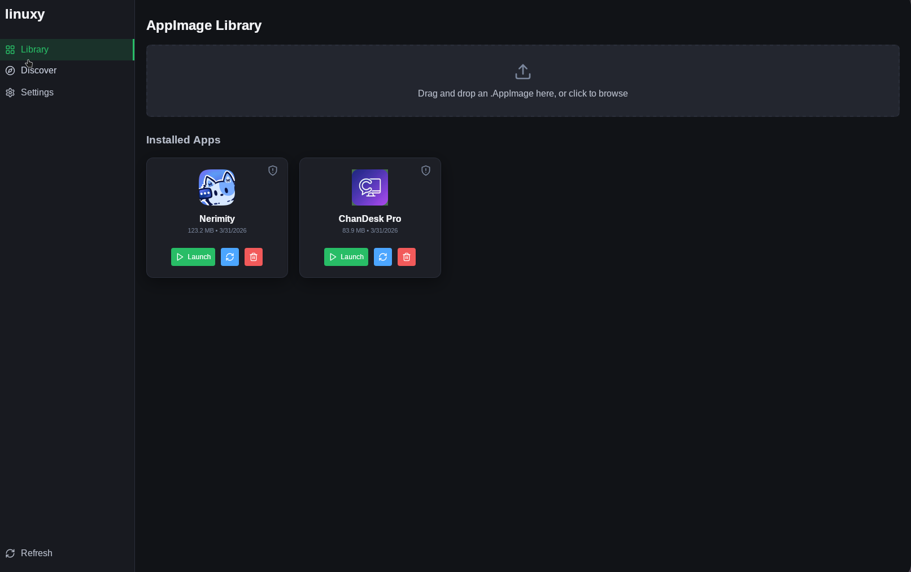
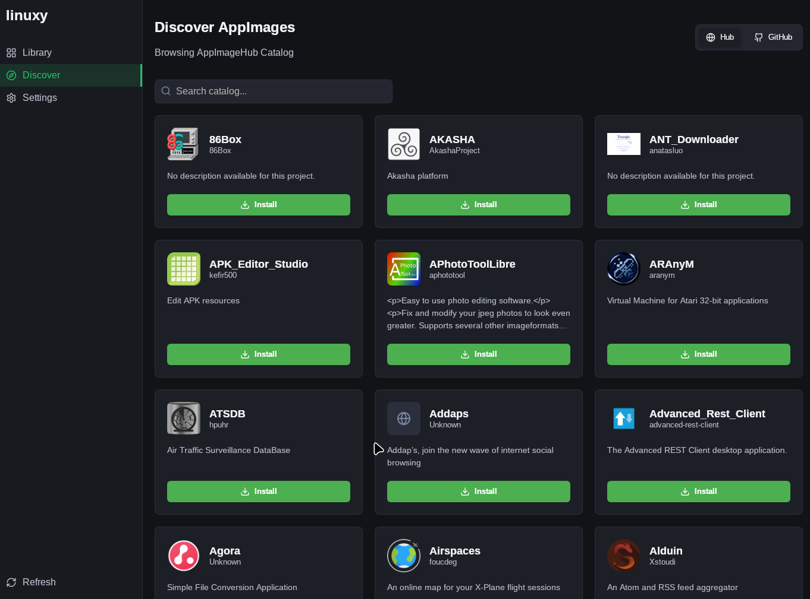
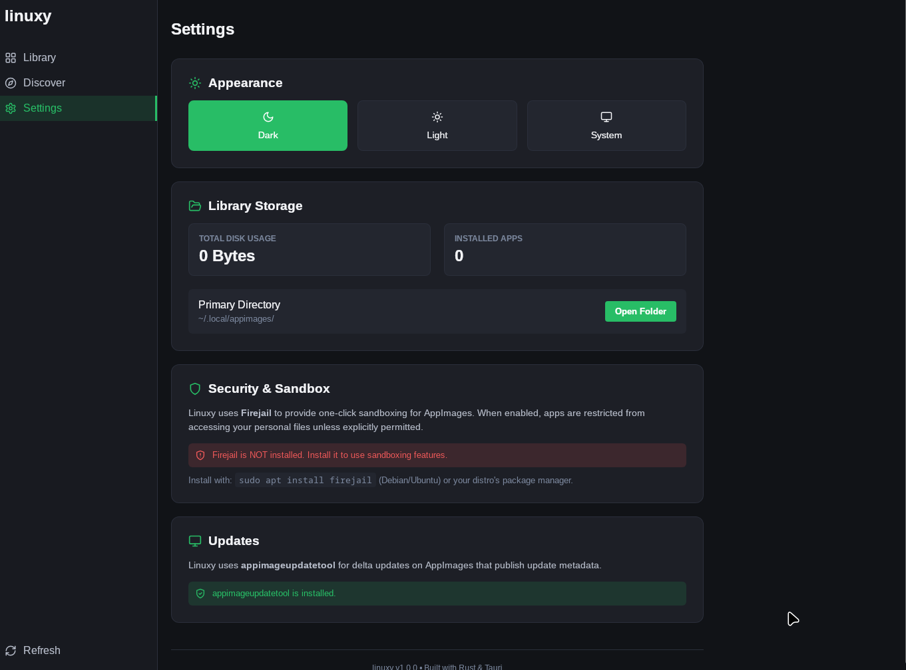
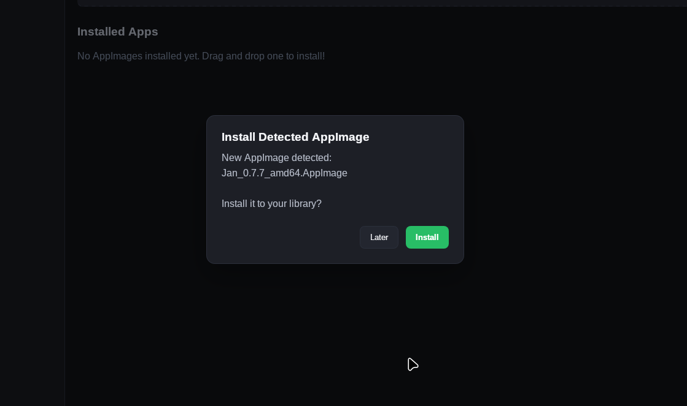

<div align="center">
  

  # Linuxy

  **AppImage manager that doesn't get in your way.**

  <p>
    <a href="LICENSE"></a>
    <a href="https://github.com/swadhinbiswas/linuxy/releases"></a>
    <a href="https://github.com/swadhinbiswas/linuxy/actions"></a>
    <a href="https://aur.archlinux.org/packages/linuxy"></a>
  </p>

  <p>
    Install, browse, sandbox, and update AppImages from one window.<br/>
    Drag, drop, done.
  </p>
</div>

##

<div align="center">
  <table>
    <tr>
      <td></td>
      <td></td>
    </tr>
    <tr>
      <td align="center"><i>Library &mdash; installed apps at a glance</i></td>
      <td align="center"><i>Discover &mdash; browse AppImageHub + GitHub</i></td>
    </tr>
    <tr>
      <td></td>
      <td></td>
    </tr>
    <tr>
      <td align="center"><i>Settings &mdash; themes, storage, sandboxing</i></td>
      <td align="center"><i>Auto-detect &mdash; watches your Downloads folder</i></td>
    </tr>
  </table>
</div>

## Features

- **Drag-and-drop install** &mdash; drop an AppImage, Linuxy extracts metadata, icons, creates the `.desktop` entry, and copies it to `~/.local/appimages/`. Done.
- **App discovery** &mdash; browse the [AppImageHub](https://appimage.github.io) catalog or search GitHub repos tagged `appimage`. Install in one click.
- **Firejail sandboxing** &mdash; toggle per-app. Enabled apps run under `firejail --appimage` with restricted filesystem and network access.
- **Delta updates** &mdash; bundles `appimageupdatetool`. Only fetches the binary diff, not the whole AppImage.
- **Downloads watcher** &mdash; notices new AppImages in `~/Downloads` and prompts to install. "Later" snoozes until the next one appears.
- **CLI mode** &mdash; `linuxy install ./App.AppImage`, `linuxy list`, `linuxy launch AppName`. Works headless.
- **Dark/Light/System themes** &mdash; persists across sessions.
- **Storage dashboard** &mdash; disk usage and app count at a glance.

## Install

### Quick Install (Recommended)

The easiest way to install Linuxy on any Linux distribution (Ubuntu, Fedora, Arch, openSUSE, etc.) is using our universal installation script. It will automatically detect your package manager (APT, DNF, Zypper) and download the right package, or fall back to the universal AppImage.

```bash
curl -fsSL https://raw.githubusercontent.com/swadhinbiswas/linuxy/main/install.sh | bash
```

---

### Manual Methods

If you prefer to install things manually, you can choose from the options below:

<details>
<summary><b>Debian / Ubuntu / Mint / Pop!_OS</b></summary>
<br>

Download the latest `.deb` from [releases](https://github.com/swadhinbiswas/linuxy/releases/latest) and install it:
```bash
sudo apt install ./linuxy_*_amd64.deb
```
</details>

<details>
<summary><b>Fedora / RHEL / openSUSE</b></summary>
<br>

Download the latest `.rpm` from [releases](https://github.com/swadhinbiswas/linuxy/releases/latest) and install it:
```bash
# Fedora / RHEL
sudo dnf install ./linuxy-*.rpm

# openSUSE
sudo zypper install ./linuxy-*.rpm
```
</details>

<details>
<summary><b>Arch Linux (AUR)</b></summary>
<br>

```bash
yay -S linuxy     # or paru -S linuxy
```
</details>

<details>
<summary><b>Any distro (AppImage)</b></summary>
<br>

Download the `.AppImage` from [releases](https://github.com/swadhinbiswas/linuxy/releases/latest):
```bash
chmod +x Linuxy_*.AppImage
./Linuxy_*.AppImage
```
*(Running it once will register the desktop shortcuts automatically)*
</details>

<details>
<summary><b>Build from source</b></summary>
<br>

```bash
git clone https://github.com/swadhinbiswas/linuxy.git
cd linuxy
bun install
bun run tauri build
```
</details>

## Usage

**GUI** — three tabs:

| Tab | What it does |
|-----|-------------|
| **Library** | Your installed apps. Launch, toggle sandbox, check updates, remove. Drag new AppImages here. |
| **Discover** | Browse AppImageHub or search GitHub. One-click install. |
| **Settings** | Theme toggle, storage stats, Firejail / updater status. |

**CLI** — commands for scripting and headless use:

```bash
linuxy install ~/Downloads/App.AppImage   # install from path
linuxy install https://example.org/app    # install from URL
linuxy list                               # list installed apps
linuxy launch AppName                     # launch by name
linuxy remove AppName                     # remove by name
linuxy --help                             # full command list
```

## Configuration

| Location | Purpose |
|----------|---------|
| `~/.local/appimages/` | AppImage binaries |
| `~/.local/share/applications/` | `.desktop` entries |
| `~/.local/share/icons/hicolor/*/apps/` | Extracted icons |

**Firejail**: install it with your distro's package manager, then toggle per-app from the GUI. When enabled, Linuxy rewrites the `.desktop` `Exec=` line to prepend `firejail --appimage`.

**Wayland users**: Linuxy runs via XWayland by default (`WEBKIT_DISABLE_COMPOSITING_MODE=1`). No configuration needed.

## Architecture

```
linuxy/
├── src/                        # React + TypeScript
│   ├── App.tsx
│   ├── components/
│   │   ├── Sidebar.tsx
│   │   ├── AppGrid.tsx
│   │   ├── DropZone.tsx
│   │   └── Storefront.tsx
│   └── main.tsx
│
├── src-tauri/                  # Rust backend (Tauri 2)
│   ├── src/
│   │   ├── main.rs
│   │   ├── installer.rs
│   │   ├── manager.rs
│   │   ├── updater.rs
│   │   ├── watcher.rs
│   │   ├── downloader.rs
│   │   └── cli.rs
│   ├── capabilities/           # Tauri 2 permission manifests
│   ├── binaries/               # Sidecar binaries
│   └── icons/
│
├── packaging/                  # Distro-specific packaging
│   ├── aur/
│   ├── alpine/
│   ├── gentoo/
│   ├── rpm/
│   ├── solus/
│   └── void/
│
├── debian/                     # Debian packaging (dpkg-buildpackage)
├── flake.nix                   # Nix flake
├── docs/
└── assets/
```

Stack: **React 18 + TypeScript** frontend, **Rust + Tauri 2** backend. Bundles via **Vite 5**, packages for DEB, RPM, AppImage, AUR, Nix, Alpine, Void, Solus, Gentoo.

## Development

```bash
# System deps (Ubuntu/Debian)
sudo apt install libwebkit2gtk-4.1-dev build-essential libssl-dev \
  libgtk-3-dev libayatana-appindicator3-dev librsvg2-dev libxdo-dev

# Start dev server
bun install
bun run tauri dev

# Run checks
bun run typecheck
bun run lint
cd src-tauri && cargo clippy && cargo test
```

## Contributing

PRs welcome. Keep it simple:

```bash
git clone https://github.com/YOUR_USERNAME/linuxy.git
git checkout -b feat/your-thing
# make changes
git commit -m "feat: what you did"
git push origin feat/your-thing
```

Open a pull request. See [CONTRIBUTING.md](CONTRIBUTING.md) for details.

## License

MIT. See [LICENSE](LICENSE).

---

<div align="center">
  <sub>Made for the Linux desktop.</sub>
</div>
